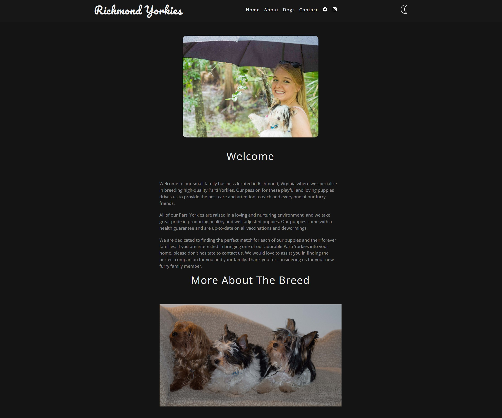
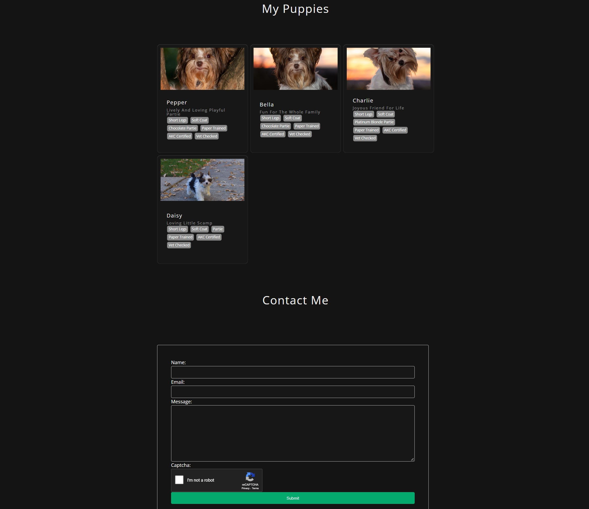
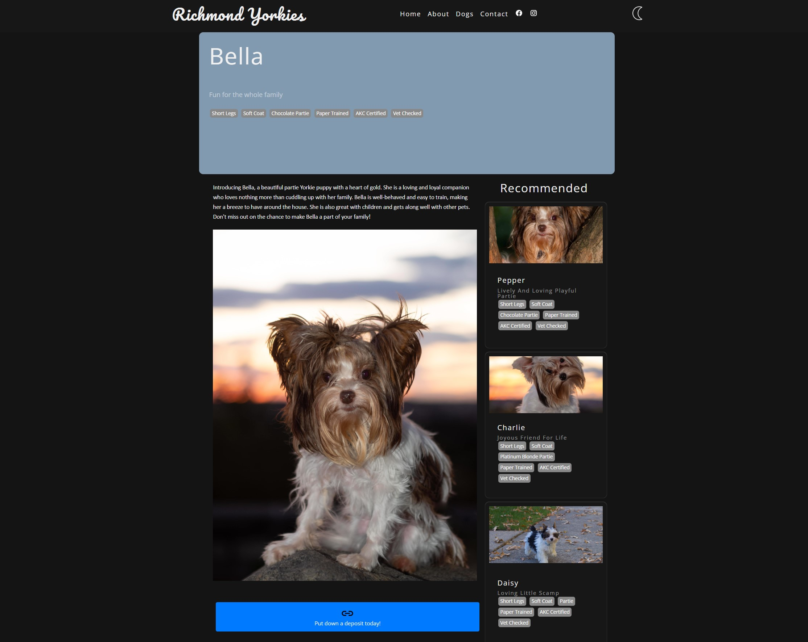
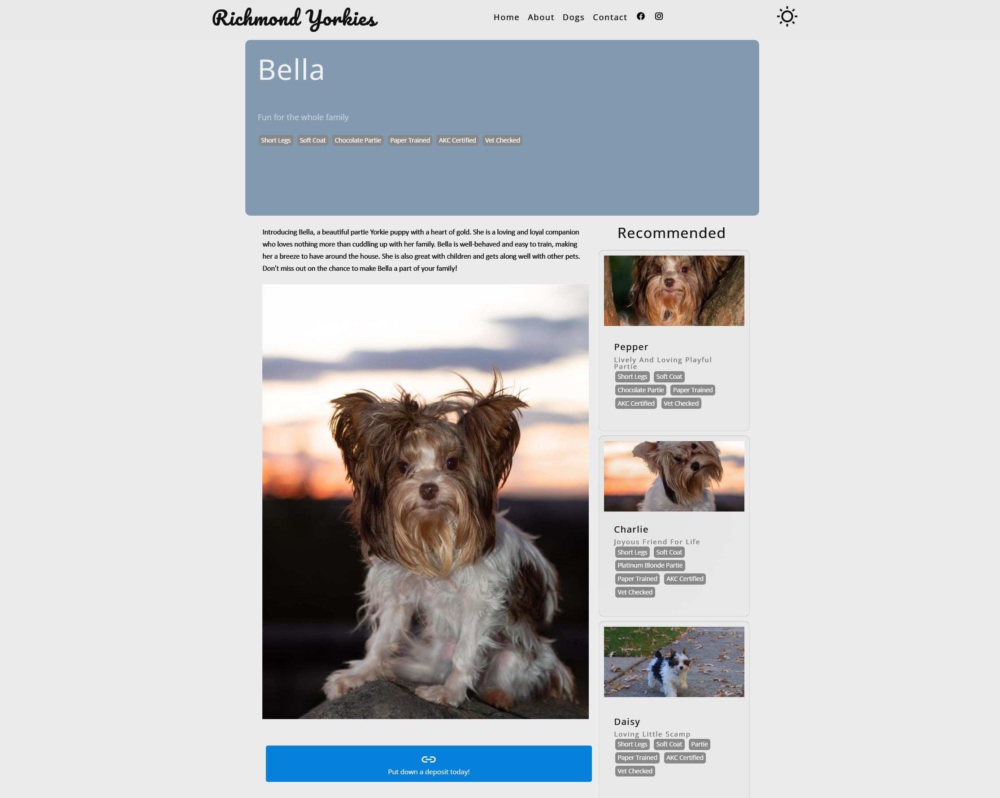

# Richmond Yorkies 
## A Parti Yorkie breeding website for interest buyers

A Python Django website for a party yorkie breeding business where customers can find information about the breed, available puppies, and make reservations to adopt a parti yorkie. The website also includes a section for the breeder to post updates and information about their breeding practices and any upcoming litters.

## Table of contents

- [Overview](#overview)
  - [The challenge](#the-challenge)
  - [Screenshots](#screenshots)
  - [Links](#links)
- [My process](#my-process)
  - [Built with](#built-with)
  - [What I learned](#what-i-learned)
  - [Continued development](#continued-development)
- [Author](#author)

## Overview

### The challenge

-A homepage with a brief overview of the business and its mission, as well as a gallery of images showcasing the parti yorkies.

-An "About Us" page with more detailed information about the business and its breeding practices, including any certifications or awards.

-A "Puppies" page with photos and descriptions of the available puppies, including their age, gender, color, and any relevant health information.

-A reservation system where customers can select a puppy and submit their contact information to request more information or schedule a visit to meet the puppy in person.

-A "News" section where the business can post updates about their breeding practices, new litters, and other relevant information.

-A contact form or email address where customers can get in touch with the business for more information or to ask questions.

### Screenshots

### Links

- Website URL: [RichmondYorkies.com](https://www.richmondyorkies.com/)

## My process

The project utilizes Linode to serve webpages with Apache2 and mod_wsgi, AWS S3 buckets to serve static and images, and AWS RDS to maintain the MySQL database. The HTML and CSS both utilize custom mobile first classes and structure. The backend is handled by Django for organizing models, templates, routing, URLs, and admin functionality. The stock admin functionality makes it easy for system administrators to add in new puppies or update news and information. 

### Built with

- AWS S3 Buckets
- AWS RDS
- Linode Ubuntu Server
- MySQL
- Django
- Desktop-first workflow

### What I learned

I learned a lot about the Django web framework and initializing and maintaining a Linux server for this application. There was also a lot I learned about AWS and the many serves it has to offer. Bootstrap was also a big help in making the templating much easier. I also learned how to make a dynamic light/dark mode changer utilizing JS to easily switch the color pallet but now the colors of images.

### Continued development

I will continue to work on implementing new features, improving the style of the website, maintaining the server, and updating the puppy roster as they find new homes.

## Author

- [My Portfolio Site](https://www.stephen.photography/portfolio)